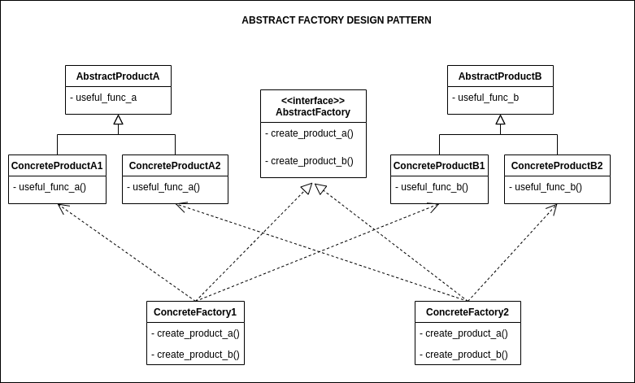

## Source

https://refactoring.guru/design-patterns/abstract-method

## Cốt lõi:

> Abstract Factory là một mẫu thiết kế sáng tạo cho phép bạn tạo ra các families của các đối tượng liên quan mà không
> cần chỉ định cụ thể lớp của chúng.

## Structure



Các bước tạo abstract method chính:

1. **Xác định một lớp trừu tượng (abstract class):** Đầu tiên, bạn cần tạo một lớp trừu tượng (abstract class). Lớp này
   sẽ chứa các abstract method mà các lớp con sau này phải triển khai.
2. **Khai báo abstract method:** Trong lớp trừu tượng, bạn khai báo các abstract method bằng cách sử dụng từ khóa
   abstract trước phương thức mà bạn muốn là abstract. Điều này sẽ định nghĩa phương thức mà các lớp con phải triển
   khai. Abstract method không có thân phương thức (body) và chỉ có khai báo phương thức.
3. **Triển khai abstract method trong các lớp con:** Các lớp con kế thừa từ lớp trừu tượng sẽ phải triển khai (
   implement) các abstract method được định nghĩa trong lớp trừu tượng. Điều này bắt buộc các lớp con phải cung cấp một
   triển khai cụ thể cho mỗi abstract method.

## Description

### Mục đích

Mục đích của abstract method trong design pattern là tạo ra một interface chung cho các lớp con để chúng có thể triển
khai theo cách riêng biệt, tùy chỉnh cho nhu cầu cụ thể của từng lớp con. Abstract method là một phần quan trọng của các
mẫu thiết kế (design patterns) như Factory Method Pattern, Template Method Pattern và Strategy Pattern.

Các lợi ích chính của việc sử dụng abstract method trong design pattern bao gồm:

1. **Tách rời các phần của hệ thống:** Abstract method cho phép bạn xác định các phần của hệ thống mà các lớp con cần
   triển khai. Điều này giúp tách rời các phần của hệ thống, giúp dễ dàng thay đổi hoặc mở rộng chúng mà không làm ảnh
   hưởng đến các phần khác.
2. **Tích hợp linh hoạt:** Các lớp con có thể triển khai abstract method theo cách riêng biệt, cho phép tích hợp các
   phần mềm dễ dàng theo nhiều cách khác nhau mà không cần thay đổi mã nguồn của các lớp cha.
3. **Tạo ra các mẫu chung:** Abstract method giúp xác định các mẫu chung trong các hệ thống phức tạp. Chúng là một phần
   quan trọng của các mẫu thiết kế, giúp tạo ra cách tiếp cận chung cho việc giải quyết các vấn đề cụ thể.
4. **Mở rộng và bảo trì dễ dàng:** Abstract method cho phép bạn thêm mới các lớp con mà không cần thay đổi mã nguồn của
   các lớp cha, giúp dễ dàng mở rộng và bảo trì hệ thống.

Tóm lại, abstract method là một cơ chế quan trọng trong design pattern để giúp tạo ra các hệ thống linh hoạt, dễ bảo trì
và mở rộng.

## Khi nào thì sử dụng abstract method

1. **Khi bạn muốn định nghĩa một interface chung:** Khi có một nhóm lớp có cùng một interface chung, nhưng mỗi lớp con
   có cách triển khai riêng biệt, bạn có thể sử dụng abstract methods để định nghĩa interface và yêu cầu các lớp con
   triển khai các phương thức cụ thể.
2. **Khi bạn muốn áp dụng mẫu thiết kế Factory Method:** Factory Method Pattern sử dụng abstract methods để tạo đối
   tượng mà lớp cha không thể biết trước cụ thể lớp con nào cần được tạo.
3. **Khi bạn muốn sử dụng Template Method Pattern:** Template Method Pattern sử dụng abstract method để xác định các
   bước cơ bản trong một thuật toán và để các lớp con triển khai các phần cụ thể của thuật toán.
4. **Khi bạn muốn sử dụng Strategy Pattern:** Strategy Pattern sử dụng abstract method để định nghĩa một loạt các thuật
   toán và cho phép lựa chọn thuật toán cụ thể trong runtime.
5. **Khi bạn muốn tạo các lớp cơ sở (base classes) không hoàn chỉnh:** Abstract methods cho phép bạn tạo các lớp cơ sở
   mà không cung cấp triển khai cụ thể cho một số phương thức, để bắt buộc các lớp con triển khai chúng.
6. **Khi bạn muốn đảm bảo tính đồng nhất và tuân thủ trong hệ thống:** Abstract methods giúp đảm bảo rằng các lớp con
   phải triển khai các phương thức cụ thể, từ đó đảm bảo tính đồng nhất và tuân thủ trong hệ thống.

Tóm lại, bạn nên sử dụng Factory Method khi cần tạo đối tượng một cách linh hoạt, duy trì tính linh hoạt trong ứng dụng
và giảm sự phụ thuộc vào lớp cụ thể.

## Running

```
python main.py
python example.py
```