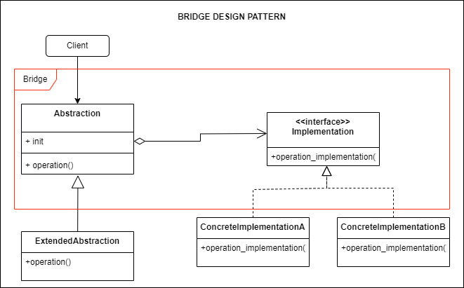

## Source

https://refactoring.guru/design-patterns/bridge

### Important:

> 1. Bridge is a structural design pattern that lets you split a large class or a set of closely related classes into two separate hierarchies—abstraction and implementation—which can be developed independently of each other.
> 2. Separates an object's interface from its implementation

## Description

## Structure



## How to use

1. Use the Bridge pattern when you want to divide and organize a monolithic class that has several variants of some functionality (for example, if the class can work with various database servers).
2. Use the pattern when you need to extend a class in several orthogonal (independent) dimensions.
3. Use the Bridge if you need to be able to switch implementations at runtime.
## How to implement

https://refactoring.guru/design-patterns/bridge#checklist

## Running

```
python main.py
python example.py
```