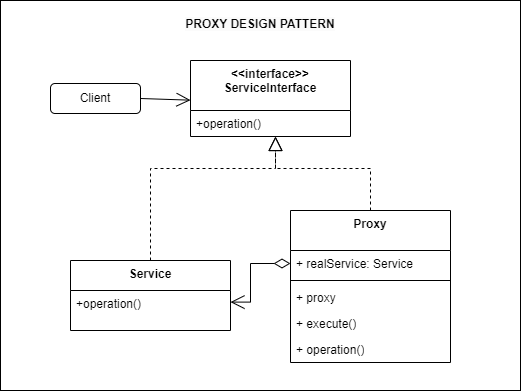

## Source

https://refactoring.guru/design-patterns/proxy

## Cốt lõi:

> Decorator là một mẫu thiết kế cấu trúc cho phép bạn đính kèm các hành vi mới vào các đối tượng bằng cách đặt những đối
> tượng này vào bên trong các đối tượng bọc đặc biệt chứa các hành vi.

## Structure



Các bước tạo một proxy

**1. Xác định Interface hoặc Abstract Class:**

- Đầu tiên, bạn cần xác định một Interface hoặc Abstract Class mà cả Proxy và Real Subject (đối tượng thực sự) sẽ triển
  khai. Điều này giúp đảm bảo rằng cả Proxy và Real Subject có cùng một interface, và Proxy có thể đại diện cho Real
  Subject.

**2. Triển khai Real Subject:**

- Tạo một lớp triển khai Interface hoặc Abstract Class đã xác định. Đây là đối tượng thực sự mà Proxy sẽ kiểm soát quyền
  truy cập.

**3. Tạo lớp Proxy:**

- Tạo một lớp Proxy cũng triển khai interface hoặc kế thừa từ lớp trừu tượng đã xác định ở bước 1. Lớp Proxy này sẽ chứa
  một tham chiếu đến Real Subject và kiểm soát quyền truy cập đến nó.

**4. Thêm logic kiểm soát truy cập:**

- Trong lớp Proxy, bạn có thể thêm logic để kiểm soát việc truy cập đến Real Subject. Ví dụ, bạn có thể thực hiện kiểm
  tra quyền truy cập, lazy loading, bổ sung chức năng bổ sung, hoặc ghi nhật ký trước/sau khi truy cập Real Subject.

**5. Sử dụng Proxy:**

- Sử dụng lớp Proxy thay vì trực tiếp sử dụng Real Subject. Lớp Proxy sẽ đại diện cho Real Subject và kiểm soát quyền
  truy cập.

## Description

### Mục đích

Mục đích chính của Proxy Design Pattern là kiểm soát truy cập đến đối tượng thực sự (Real Subject) bằng cách tạo ra một
lớp trung gian (Proxy) để đại diện cho nó. Một số mục đích chính của mẫu Proxy là:

**1. Kiểm soát truy cập:** Proxy cho phép bạn thêm logic kiểm soát truy cập vào đối tượng thực sự. Bạn có thể kiểm tra
quyền truy cập, xác thực, hoặc thực hiện kiểm tra trước khi cho phép truy cập đến Real Subject.

**2. Lazy loading:** Proxy cho phép bạn tải dữ liệu hoặc tạo đối tượng thực sự chỉ khi cần thiết. Điều này có thể cải
thiện hiệu suất và tối ưu hóa tài nguyên bằng cách tránh tải các tài nguyên không cần thiết từ đầu.

**3. Bổ sung chức năng:** Proxy có thể bổ sung các chức năng bổ sung cho đối tượng thực sự mà không cần thay đổi nó. Ví
dụ, bạn có thể thêm ghi nhật ký, thống kê, hoặc ghi nhớ kết quả để tối ưu hóa các hoạt động của Real Subject.

**4. Tạo điểm truy cập:** Proxy có thể tạo ra điểm truy cập vào các đối tượng ở xa, như đối tượng từ xa (Remote Proxy)
để truy cập đối tượng trên mạng hoặc đối tượng nắm giữ (Virtual Proxy) để truy cập đối tượng có kích thước lớn.

**5. Cải thiện hiệu suất:** Khi sử dụng Proxy, bạn có thể thực hiện tối ưu hóa để cải thiện hiệu suất ứng dụng. Ví dụ,
bạn có thể lưu cache kết quả để tránh tính toán lại những điều đã tính toán trước đó.

**6. Điều khiển đồng thời:** Proxy cũng có thể được sử dụng để kiểm soát truy cập đồng thời vào đối tượng thực sự. Bằng
cách giới hạn số lượng lần truy cập đồng thời, bạn có thể quản lý tài nguyên hiệu quả.

## Khi nào thì sử dụng proxy

1. **Lazy Loading:** Khi bạn muốn tải một đối tượng hoặc dữ liệu chỉ khi nó cần thiết. Thay vì tải toàn bộ dữ liệu từ
   đầu, bạn có thể sử dụng một Proxy để tải dữ liệu hoặc đối tượng thực sự chỉ khi người dùng yêu cầu.

2. **Kiểm soát truy cập:** Khi bạn muốn kiểm soát quyền truy cập đến một đối tượng thực sự. Proxy cho phép bạn thêm
   logic kiểm tra quyền truy cập, xác thực, hoặc kiểm tra trước trước khi cho phép truy cập đến đối tượng thực sự.

3. **Bổ sung chức năng:** Khi bạn muốn bổ sung chức năng bổ sung vào đối tượng thực sự mà không cần thay đổi nó. Proxy
   cho phép bạn thêm ghi nhật ký, thống kê, caching, hoặc các chức năng khác mà không làm ảnh hưởng đến đối tượng gốc.

4. **Điểm truy cập từ xa:** Khi bạn muốn truy cập đối tượng ở xa hoặc trên mạng. Remote Proxy cho phép bạn truy cập đối
   tượng từ xa mà không cần biết chi tiết cách thức truy cập nó.

5. **Virtual Proxy:** Khi bạn muốn tạo một ảnh ảo của đối tượng thực sự để tránh tạo nó cho đến khi cần. Virtual Proxy
   được sử dụng để tối ưu hóa tài nguyên và cải thiện hiệu suất.

6. **Cache Proxy:** Khi bạn muốn lưu trữ kết quả tính toán để tránh tính toán lại chúng nếu cùng một yêu cầu được gửi
   lại. Proxy cho phép bạn lưu trữ cache và trả về kết quả từ cache khi cần.

7. **Điều khiển đồng thời:** Khi bạn muốn giới hạn số lượng lần truy cập đồng thời vào một đối tượng. Proxy có thể được
   sử dụng để quản lý tài nguyên và điều khiển đồng thời.

8. **Logging và ghi nhật ký:** Khi bạn muốn ghi nhật ký các hoạt động truy cập đối tượng thực sự để theo dõi và xác định
   sự kiện trong ứng dụng.

## Running

```
python main.py
python example.py
```